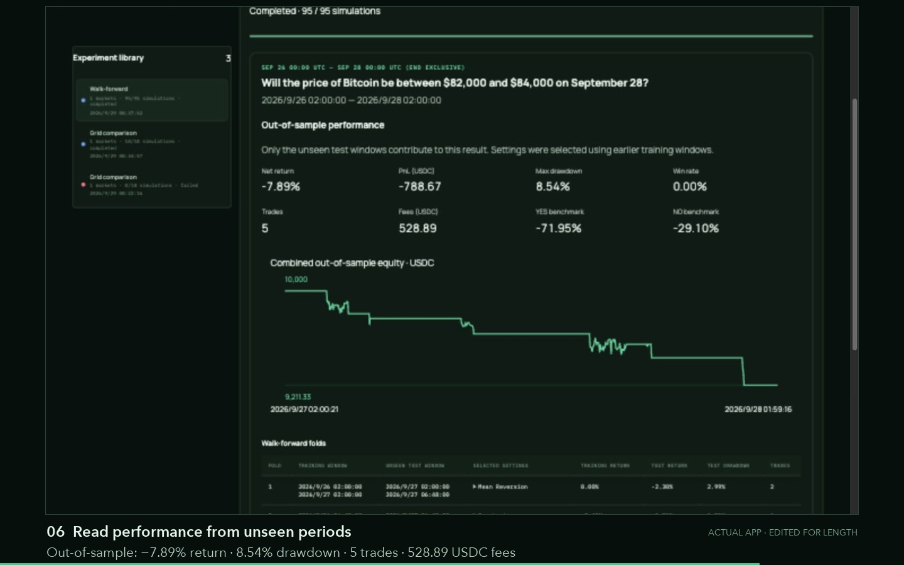

# Strategy comparison and walk-forward demo

[Watch or download the MP4](strategy-comparison-walk-forward.mp4) ·
[English captions](strategy-comparison-walk-forward.srt)

This 67-second recording shows the signed-in Polytrade app using real Polymarket
historical data in a 1440 × 900 desktop layout. It includes narration and captions;
waiting time is condensed. The UI and simulation results are actual app output.

The flow is chat → 18-combination comparison → live progress → rankings and exact
settings → conversational walk-forward follow-up → 95 simulations → unseen-period
equity and five fold results.

The example compares momentum, mean reversion, and breakout on Polymarket market
4797487 (Bitcoin $82,000–$84,000 on September 28, 2026). It uses September 26 at
00:00 UTC through September 28 at 00:00 UTC, end exclusive, with 10,000 USDC of
simulated capital. The grid varies take-profit (0.01 / 0.015) and maximum hold
(60 / 120 / 180 minutes), keeping other strategy defaults.

The leading in-sample candidate returns −6.14%; the combined unseen-period result
returns −7.89%. These historical simulations include the app's modeled costs and
execution assumptions. They do not place live trades or predict future returns.
Dates in the app are displayed in the browser's local timezone.
